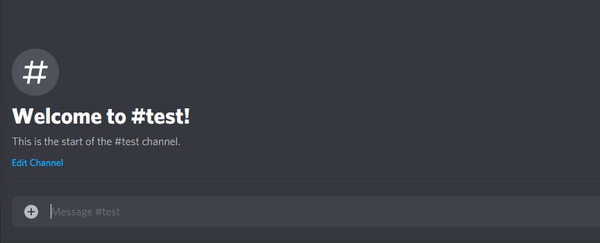
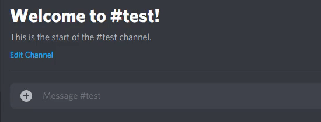
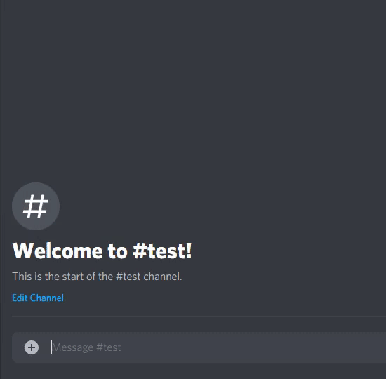
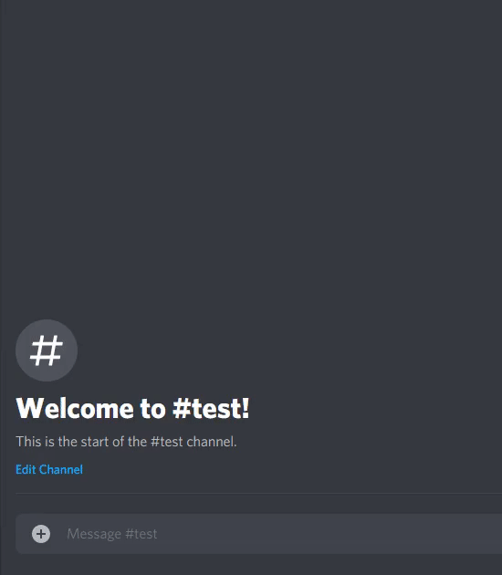

# RiotBot
 A discord bot for the Riot API.
 
 
# How to setup:
**To setup the RiotBot follow these steps:**

- Get a Discord API key.
    Create a Discord application and get the API key with [Discords developer portal](https://discord.com/developers/applications). 

- Get a Riot API key. *(optional)**  
    Get a Riot API key from the [Riot developer portal](https://developer.riotgames.com/).
    This step is not needed if ```!riot {username}``` command is not used.

- Place your keys in the keys.json file.

- Invite your Discord bot if you want to be able to use it in a server. *(optional)**  
    If you want to invite a Discord bot to a server, follow [this](https://discordpy.readthedocs.io/en/latest/discord.html#inviting-your-bot) tutorial.
    This step is not needed if only used 

- Install Python 3.8 if not installed.  
    Download [here](https://www.python.org/downloads/).

- Install the Python request library if not installed.  
    To install this library follow the [requests install tutorial](https://requests.readthedocs.io/en/latest/user/install/#install).

- Run the DiscordBot.py script


# Bot commands (how to use):
This bot can be used by sending commands with direct message to the bot.
If the optional step is taken of inviting your bot to a server you can also talk to it by typing in a text channel that the bot has access to.
The following commands are available for use.

## !riot {username}
Gives all types of identification of a Riot account and what type of League of Legends icon and level it has.



## !season
Gives the current season of League of legends.



## !maps
Gives all maps that exist within League of Legends although many are not available for use.



## !modes
Gives all modes that exist within League of Legends although many are not available for use.


    
